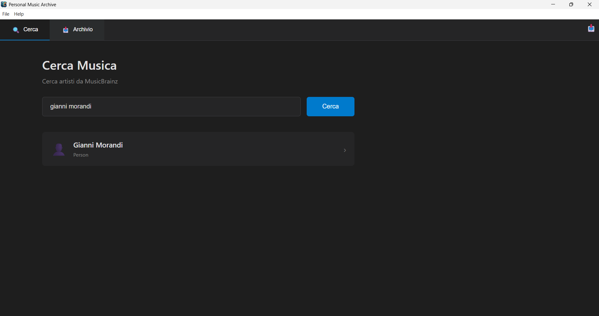
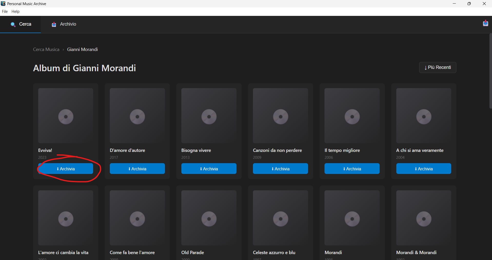
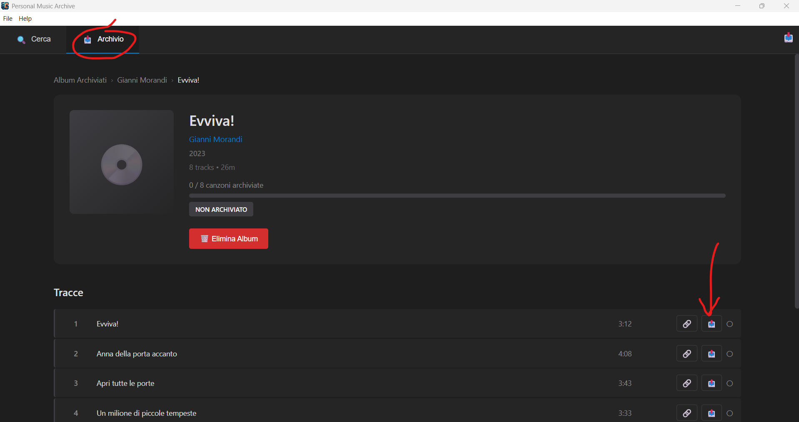
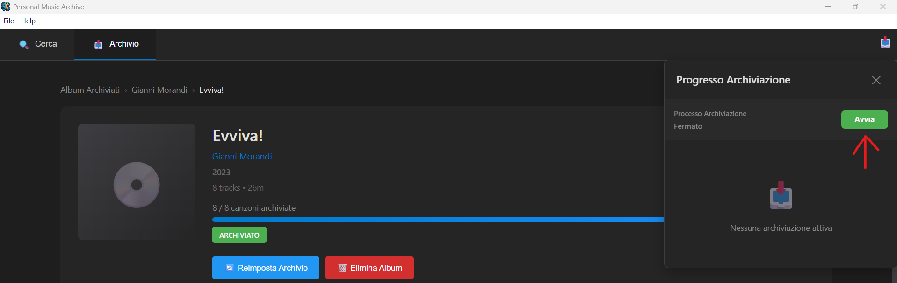
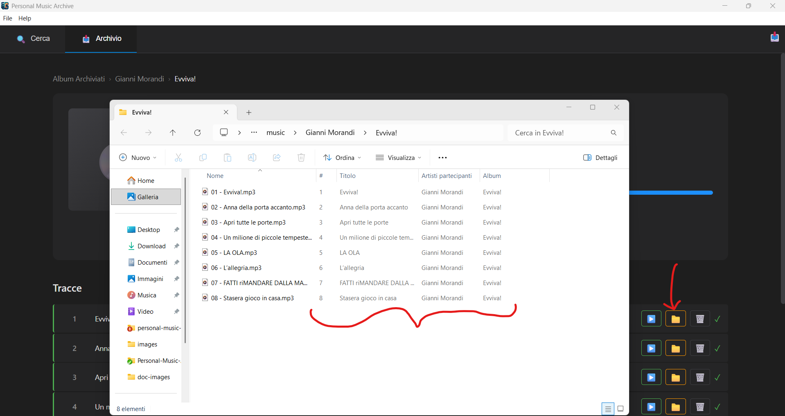

# Personal Music Archiver

A desktop application designed to help you organize and archive your music collection in a format compatible with **Plex Media Server**. This tool simplifies the process of cataloging albums with proper metadata and file organization, making it easy to build a well-structured music library that Plex can automatically recognize and display.

## What is Plex?

[Plex Media Server](https://www.plex.tv/) is a popular media management system that organizes your video, music, and photo collections and streams them to all your devices. For music, Plex automatically recognizes albums, artists, and tracks when they are properly organized and tagged with metadata. Personal Music Archiver helps you prepare your music files in the exact format Plex expects, ensuring seamless integration with your media server.

## Features

- **MusicBrainz Integration**: Search and retrieve accurate album metadata from the MusicBrainz database
- **Automated Organization**: Files are organized in the standard `Artist/Album/Track` structure
- **Metadata Management**: Automatic ID3 tag writing (artist, album, track number, year)
- **Archive Queue System**: Background processing with progress tracking
- **Plugin Architecture**: Extensible system for automated music archiving
- **Multi-language Support**: Available in English and Italian
- **Built with Electron + Angular**: Cross-platform desktop application

## Dependencies

To run and develop Personal Music Archiver, you need:

### Required Software

1. **Visual Studio 2022** with C++ Desktop Development workload
   - Required for compiling native Node.js modules (better-sqlite3)
   - Download from [Visual Studio Downloads](https://visualstudio.microsoft.com/downloads/)
   - During installation, select "Desktop development with C++" workload

2. **Node.js 22.x**
   - Download from [nodejs.org](https://nodejs.org/)
   - Verify installation: `node --version`

### Optional Tools

- **Git** - For cloning the repository
- **npm** or **yarn** - Package manager (included with Node.js)

## Installation

1. **Clone the repository**
   ```bash
   git clone <repository-url>
   cd personal-music-archive
   ```

2. **Install dependencies**
   ```bash
   npm install
   ```

3. **Build native modules** (required for SQLite)
   ```bash
   npm run rebuild
   ```

4. **Run the application**
   ```bash
   # Development mode
   npm run electron:dev
   ```

## Plugin System

Personal Music Archiver uses a **plugin-based architecture** for archiving automation. Plugins allow you to search for and archive music from various sources without modifying the core application.

### How Plugins Work

Plugins enable automated archiving by:

1. **Searching** for music based on artist, album, and track information
2. **Retrieving** music files from your chosen source
3. **Saving** files with proper naming and metadata
4. **Organizing** files in the Plex-compatible directory and metadata structure

### Plugin Development Guide

#### Plugin Interface

Every plugin must implement the following methods:

```javascript
class MyMusicPlugin {
  // Return plugin metadata
  getMetadata() {
    return {
      id: 'my-music-plugin',
      name: 'My Music Plugin',
      version: '1.0.0',
      description: 'Archives music from my personal collection',
      author: 'Your Name'
    };
  }

  // Initialize plugin resources
  async initialize() {
    console.log('Plugin initialized');
  }

  // Check if required dependencies/tools are installed
  async checkDependencies() {
    return {
      installed: true,
      missing: [],
      message: 'All dependencies available'
    };
  }

  // Validate if a URL is supported by this plugin
  validateUrl(url) {
    return url.includes('mysource.com');
  }

  // Search for a song and return a URL
  async searchSong(artistName, songName, albumName) {
    // Your search logic here
    // Return URL string or null if not found
    return 'https://mysource.com/music/song-id';
  }

  // Download and save the song with metadata
  async downloadSong(url, artistName, albumName, trackNumber, songName, releaseYear, destinationPath) {
    // Your download logic here
    // Save to destinationPath
    
    return {
      path: destinationPath,
      duration: 180 // duration in seconds or null
    };
  }

  // Cleanup resources when plugin is unloaded
  async dispose() {
    console.log('Plugin disposed');
  }
}

// Export the plugin class
module.exports = MyMusicPlugin;
```

#### Creating a Plugin: Step by Step

1. **Create a new JavaScript file** in the plugins directory (e.g., `my-plugin.js`)

2. **Implement the plugin class** with all required methods

3. **Place the plugin file** in the appropriate directory:
   - **Windows**: `C:\Users\<username>\AppData\Roaming\music-auto-archiver\plugins`
   - **macOS**: `~/Library/Application Support/music-auto-archiver/plugins`
   - **Linux**: `~/.config/music-auto-archiver/plugins`

4. **Test your plugin**:
   - Open Personal Music Archiver → Help → Plugins
   - Click "Reload Plugin"
   - Activate your plugin
   - Try archiving a test album

#### Plugin Best Practices

✅ **Do:**
- Handle errors gracefully
- Log important events for debugging
- Clean up temporary files
- Validate URLs before processing
- Write complete metadata tags
- Check dependencies in `checkDependencies()`

❌ **Avoid:**
- Blocking the main thread
- Storing sensitive credentials in code
- Downloading to incorrect paths

#### Example Plugin Use Cases

- **Personal Library Importer**: Import existing MP3 files from local storage
- **Streaming Service Downloader**: Archive from streaming services (ensure legal compliance for your albums)
- **Purchased Music Retriever**: Download music from digital stores where you've made purchases
- **Custom API Integration**: Connect to proprietary music service APIs

### Legal Notice

Plugins should only be used to archive music you have legal rights to access. Always ensure compliance with:

- Copyright laws in your jurisdiction
- Terms of Service of source platforms
- Licensing agreements
- Fair use and personal backup rights

The plugin system is designed to help you organize your **legally owned music collection** for use with Plex Media Server.

## Usage

1. **Search for Music**
   - Navigate to the Search page
   - Enter an artist name
   - Browse albums from MusicBrainz database
   - Click "Archive Album" to add to your collection

2. **Manage Archives**
   - View all archived albums in the Archive page
   - Track archiving progress per album
   - Monitor completed and pending songs
   - Play archived music directly in the app
   - Upload song files manually

3. **Configure Plugins**
   - Open Help → Plugins
   - View installed plugins and their status
   - Check dependency requirements
   - Activate/deactivate plugins as needed
   - Upload new plugins via the UI

4. **Archive Process**
   - Start the background archive process
   - System automatically processes pending songs
   - Monitor progress through notifications
   - Files are saved in: `Documents/Personal Music Archiver/`

## Project Structure

```
personal-music-archive/
├── electron-src/          # Electron main process
│   ├── db/               # SQLite database layer
│   ├── plugins/          # Plugin system
│   └── utils/            # Archive manager, file operations
├── src/                  # Angular application
│   ├── app/
│   │   ├── pages/       # Main UI pages
│   │   ├── services/    # Angular services
│   │   └── dialogs/     # UI dialogs
│   └── assets/
│       └── i18n/        # Translation files
├── external-plugins/     # Plugin development resources
└── public/              # Static assets
```

## Building for Development

```bash
# Run in development mode
npm run electron:dev
```

## Building for Production

Build executable packages for your target platform:

```bash
# Windows
npm run dist:win

# macOS
npm run dist:mac

# Linux
npm run dist:linux
```

These commands will:
1. Build the Angular application
2. Compile the Electron main process
3. Package everything into a distributable installer

**Output location**: Built packages will be in the `dist/` directory.


## How to Use the App

**1. Search for Albums**

After you start the app, you can search for albums by artist name. The app retrieves album information from the MusicBrainz database.



**2. Add to Your Archive**

Add the album to your archive. This creates the proper folder structure and prepares the album for file management.



**3. Add Music Files** 

Now you can add the song files you have manually. The metadata for Plex is automatically added to each file.



Alternatively, you can develop an automatic plugin to automatically add files for the music in your archive.



**4. Complete the Archive**

After the archive status is complete (all song files are present for the whole album), you can open the directory of the album in your file system. In the following image you can see also metadata added to your song files.



**5. Copy to Your Plex Folder**

Copy the album folder to your Plex music library folder. Plex will automatically detect and catalog the album. 


## Contributing

Contributions are welcome! Please:

1. Fork the repository
2. Create a feature branch (`git checkout -b feature/your-feature`)
3. Commit your changes (`git commit -am 'Add new feature'`)
4. Push to the branch (`git push origin feature/your-feature`)
5. Submit a pull request

## License

This project is licensed under the GPL v3 License. See the [LICENSE](LICENSE) file for details.

## Support

For questions, issues, or feature requests:

- Open an issue on GitHub
- Check existing documentation in the repository

---

**Built with:** Electron, Angular, TypeScript, SQLite, MusicBrainz API